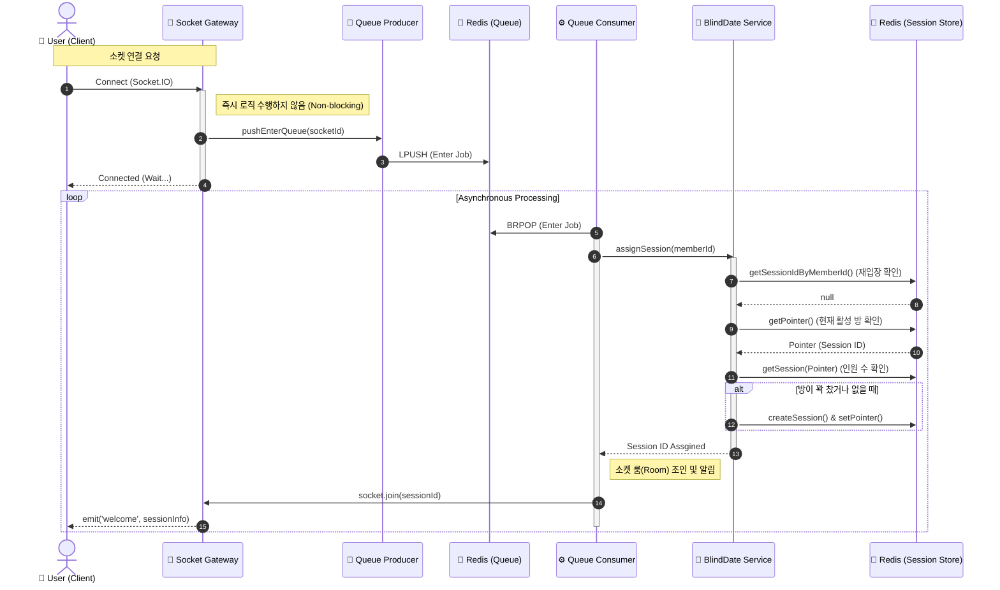
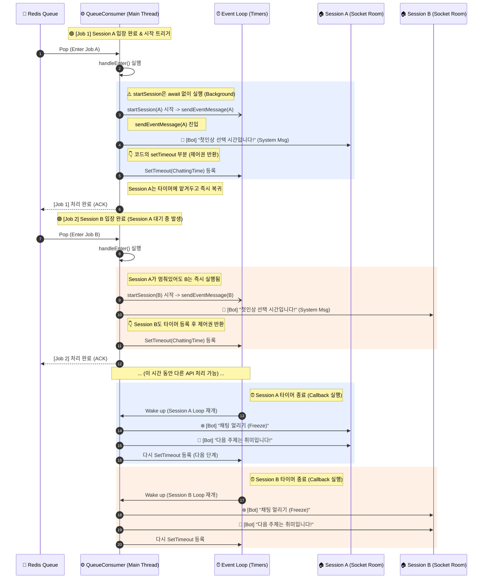

## 💘 Dongsoop Blind Date (과팅 서비스)
실시간으로 진행되는 과팅 매칭 서비스입니다.  
이벤트성으로 열리는 Dongsoop의 실시간 그룹 과팅 마이크로서비스입니다.

## 📅 프로젝트 개요
Dongsoop 과팅은 정해진 시간에만 열리는 실시간 과팅 서비스입니다.  
사용자는 라이브 세션에 입장하여 익명의 상대방들과 대화를 나누고, 마음에 드는 상대에게 투표하여 최종 매칭을 이룰 수 있습니다.  
대규모 트래픽이 몰릴 수 있는 실시간 이벤트를 안정적으로 처리하기 위해 NestJS와 Socket.IO를 기반으로 별도의 마이크로서비스로 구축되었으며, Redis와 Queue를 활용해 동시성 문제를 해결했습니다.

## 🚀 핵심 기능

### 🤝 세션 매칭

- 사용자의 입장 순서에 따라 매칭 세션에 배치되고, 7명이 모이면 세션이 시작됩니다.
- 사용자 입장 시 익명 닉네임이 부여됩니다.
   - 익명 번호는 입장 누적 수로 부여하며, 재입장 시 새로운 번호를 받게됩니다.

### 💬 진행봇에 따른 대화 진행

- 진행봇의 안내를 통해 사용자가 미리 마음에 드는 사용자를 생각해둘 수 있도록 안내합니다.
- 어색하지 않게 대화를 이어갈 수 있도록 대화 주제를 3분 간격으로 안내합니다.

### 🎯 사랑의 작대기로 마음에 드는 사람 선택

- 세션 중 마음에 들었던 사람을 선택할 수 있습니다.
- 서로를 선택한 경우 1:1 채팅방이 개설되어 대화를 이어갈 수 있습니다.

## ✨ 기술적 도전 (Problem Solving)

> 실시간 서비스의 안정성을 확보하기 위해 고민했던 기록들입니다.

### 1️⃣ 실시간 동시 접속 트래픽 제어 (with Queue)

과팅 시작 시간에 사용자가 몰릴 경우, 세션 배정 로직에서 Race Condition이 발생할 수 있습니다.  
이를 해결하기 위해 Socket Gateway에서 받은 요청을 바로 처리하지 않고 Producer-Consumer 패턴의 Queue에 적재한 뒤 순차적으로 처리하여 데이터 정합성을 보장했습니다.

### 2️⃣ Redis를 활용한 고성능 세션 관리

실시간으로 변하는 방의 상태(인원 수, 채팅 로그, 투표 현황)를 RDB에 매번 기록하는 것은 비효율적입니다.  
빠른 I/O가 필요한 세션 정보와 사용자 상태를 Redis 인메모리 저장소에서 관리하여 응답 속도를 극대화했습니다.

## 🧩 서비스 아키텍처
메인 백엔드 서버와 분리하여 실시간 I/O 처리에 특화된 구조를 설계했습니다.

### 🎟️ 입장

### 💬 세션 진행

싱글 스레드 기반으로 약 10분간 진행되는 진행봇의 순차 메시지를 기다리지 않습니다.  
진행봇의 메시지 전송 후 Promise의 콜백 함수가 호출되기 전에 다른 요청을 처리합니다.

