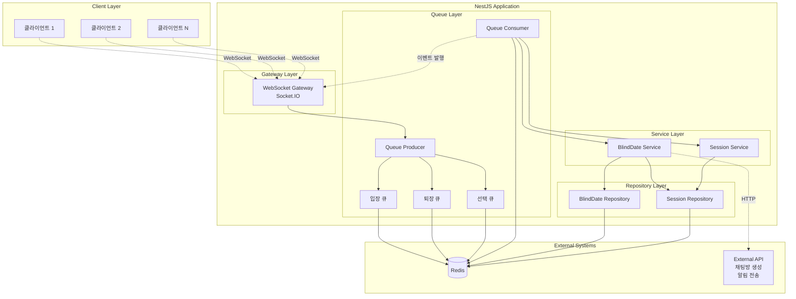
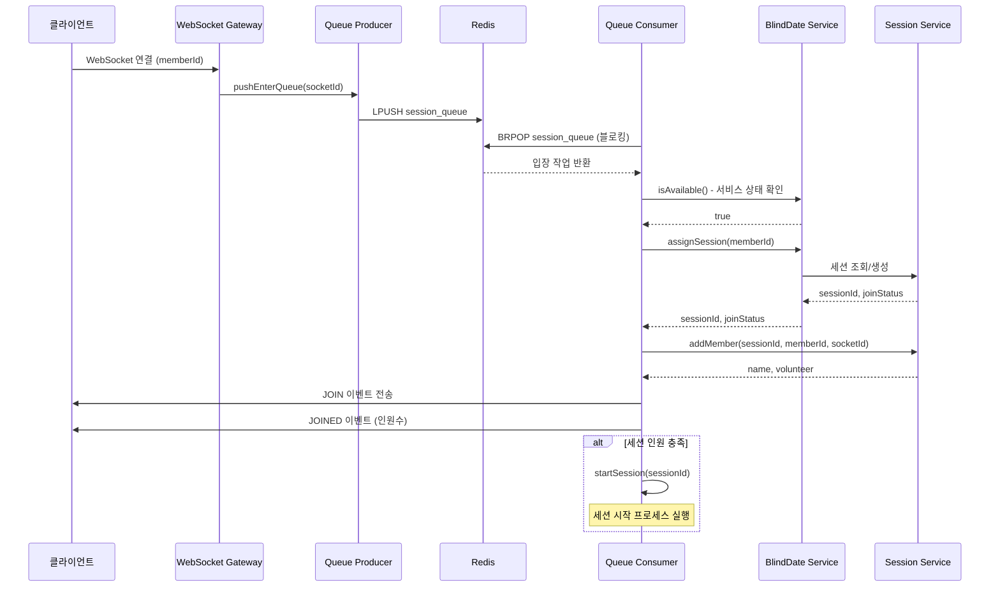
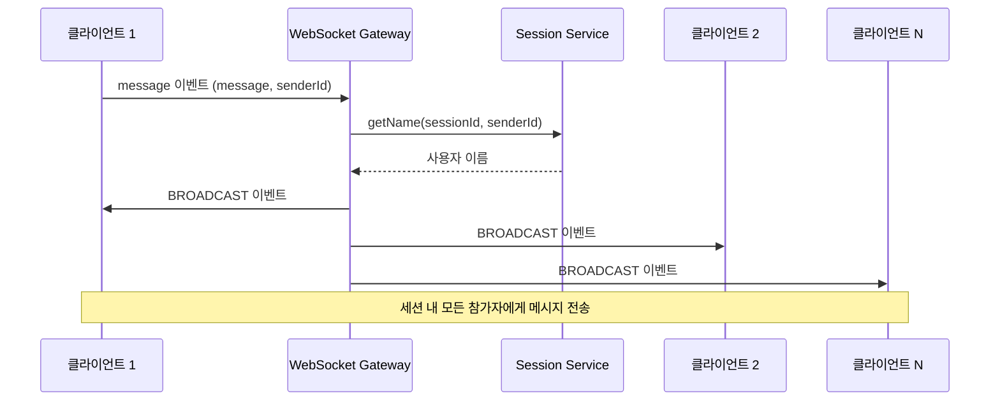
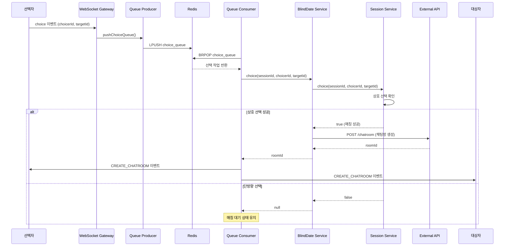
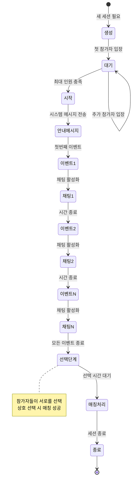

# 블라인드 데이트 프로젝트 WIKI

## 📋 목차
1. [프로젝트 개요](#프로젝트-개요)
2. [기술 스택](#기술-스택)
3. [핵심 기능](#핵심-기능)
4. [시스템 아키텍처](#시스템-아키텍처)
5. [데이터 플로우](#데이터-플로우)
6. [문제 해결 과정](#문제-해결-과정)
7. [WebSocket 이벤트](#websocket-이벤트)
8. [설치 및 실행](#설치-및-실행)

---

## 프로젝트 개요

블라인드 데이트는 실시간 소통을 통한 온라인 미팅 매칭 서비스입니다. WebSocket을 활용하여 실시간 채팅 환경을 제공하며, Redis 기반의 큐 시스템으로 안정적인 세션 관리와 매칭 프로세스를 구현합니다.

### 주요 특징
- **실시간 통신**: Socket.IO를 활용한 양방향 실시간 메시징
- **세션 기반 매칭**: 설정 가능한 인원수로 자동 세션 생성 및 배정
- **큐 시스템**: Redis를 활용한 안정적인 비동기 작업 처리
- **매칭 알고리즘**: 상호 선택 기반 1:1 매칭 시스템
- **자동 세션 관리**: 시간 기반 세션 생명주기 관리

---

## 기술 스택

### Backend Framework
- **NestJS**: TypeScript 기반의 프로그레시브 Node.js 프레임워크
- **Node.js**: 서버 사이드 JavaScript 런타임

### 실시간 통신
- **Socket.IO**: 실시간 양방향 이벤트 기반 통신
- **WebSocket**: 지속적인 연결 유지를 위한 프로토콜

### 데이터베이스 및 캐시
- **Redis**: 
  - 세션 데이터 저장
  - 큐 시스템 구현
  - 실시간 데이터 캐싱

### 기타 라이브러리
- **node-cron**: 스케줄링 작업 관리
- **axios**: HTTP 클라이언트
- **uuid**: 고유 식별자 생성

---

## 핵심 기능

### 1. 세션 관리
- 자동 세션 생성 및 사용자 배정
- 최대 인원수 기반 세션 그룹화
- 세션 상태 관리 (대기, 진행중, 종료)

### 2. 실시간 채팅
- 세션 내 실시간 메시지 전송
- 시스템 메시지 자동 발송
- 채팅 활성화/비활성화 제어

### 3. 매칭 시스템
- 참가자 간 상호 선택
- 양방향 선택 시 매칭 성공
- 자동 채팅방 생성 API 연동

### 4. 큐 기반 처리
- 입장 큐: 사용자 연결 처리
- 퇴장 큐: 사용자 연결 해제 처리
- 선택 큐: 매칭 선택 처리

---

## 시스템 아키텍처

### 전체 시스템 구조



### 주요 컴포넌트 설명

#### 1. Gateway Layer
- **BlindDateGateway**: WebSocket 연결 관리 및 이벤트 처리
- Socket.IO를 통한 실시간 양방향 통신
- 클라이언트 연결/해제 처리

#### 2. Queue Layer
- **QueueProducer**: 작업을 큐에 추가
- **QueueConsumer**: 큐에서 작업을 가져와 처리
- Redis List를 활용한 FIFO 큐 구현

#### 3. Service Layer
- **BlindDateService**: 블라인드 데이트 비즈니스 로직
- **SessionService**: 세션 관리 및 참가자 관리

#### 4. Repository Layer
- **BlindDateRepository**: 블라인드 데이트 상태 및 설정 관리
- **SessionRepository**: 세션 데이터 CRUD

---

## 데이터 플로우

### 1. 사용자 입장 플로우



### 2. 채팅 메시지 플로우



### 3. 매칭 선택 플로우



### 4. 세션 생명주기



---

## 문제 해결 과정

### 1. 동시성 문제 해결

#### 문제상황
여러 사용자가 동시에 입장할 때 세션 배정이 정확하지 않고, 동일한 세션에 최대 인원을 초과하여 배정되는 문제가 발생했습니다.

#### 해결방안
**Redis 기반 큐 시스템 도입**
- 모든 입장 요청을 큐에 순차적으로 저장
- 단일 Consumer가 순차적으로 처리하여 동시성 문제 해결
- FIFO 방식으로 공정한 처리 보장

```typescript
// Queue Producer
async pushEnterQueue(data: { socketId: string }) {
  const json = JSON.stringify({
    type: BlindDateQueue.ENTER,
    timestamp: Date.now(),
    ...data,
  });
  await this.redisClient.lPush(this.SESSION_QUEUE_KEY, json);
}

// Queue Consumer
while (!this.signal.aborted) {
  const queue = await subscriber.brPop(this.SESSION_QUEUE_KEY, 0);
  if (!queue?.element) continue;
  await this.process(JSON.parse(queue.element));
}
```

#### 효과
- 세션 배정의 정확성 보장
- Race condition 완전히 제거
- 서버 부하 분산 가능

---

### 2. 실시간 메시지 전송 최적화

#### 문제상황
모든 메시지가 Gateway에서 직접 처리되어 복잡도가 증가하고, 대량의 메시지 처리 시 성능 저하가 발생했습니다.

#### 해결방안
**Socket.IO Room 기능 활용**
- 세션 ID를 Room으로 사용
- Room 단위로 메시지 브로드캐스트
- 개인별 알림을 위한 개인 Room 추가 생성

```typescript
// 세션 Room 구독
socket.join(sessionId);
socket.join(SessionKeyFactory.getPersonalKeyName(sessionId, memberId));

// Room 단위 메시지 전송
this.server.to(sessionId).emit(EVENT_TYPE.BROADCAST, message);

// 개인 메시지 전송
this.server
  .to(SessionKeyFactory.getPersonalKeyName(sessionId, memberId))
  .emit(EVENT_TYPE.CREATE_CHATROOM, roomId);
```

#### 효과
- 메시지 전송 효율성 증가
- 불필요한 메시지 필터링 제거
- 확장성 향상

---

### 3. 세션 시간 관리

#### 문제상황
세션의 각 단계별 시간 제어가 필요했으며, 정확한 타이밍에 이벤트를 발행해야 했습니다.

#### 해결방안
**Promise 기반 타이머 구현**
- async/await를 활용한 순차적 이벤트 처리
- 설정 가능한 시간 상수로 유연성 확보
- node-cron을 활용한 전체 서비스 종료 시간 스케줄링

```typescript
// 이벤트 메시지 전송 + 채팅 시간 제어
for (const message of this.blindDateMessage.getEventMessage(amount)) {
  // 채팅 비활성화
  this.server.to(sessionId).emit(EVENT_TYPE.FREEZE);
  
  // 시스템 메시지 전송
  this.server.to(sessionId).emit(EVENT_TYPE.SYSTEM, message);
  
  // 메시지 대기 시간
  await new Promise<void>((resolve) => {
    setTimeout(() => {
      this.server.to(sessionId).emit(EVENT_TYPE.THAW);
      resolve();
    }, this.MESSAGE_WAITING_TIME);
  });
  
  // 채팅 시간
  await new Promise<void>((resolve) => {
    setTimeout(resolve, this.CHATTING_TIME);
  });
}

// 전체 서비스 종료 스케줄링
const expression = `0 ${minute} ${hour} ${day} ${month + 1} * *`;
nodeCron.schedule(expression, async () => {
  await this.blindDateRepository.closeBlindDate();
});
```

#### 효과
- 정확한 세션 타이밍 제어
- 예측 가능한 사용자 경험
- 유지보수 용이성 향상

---

### 4. 재연결 처리

#### 문제상황
네트워크 불안정으로 사용자가 연결이 끊겼다가 재연결할 때, 기존 세션 정보가 유지되지 않는 문제가 발생했습니다.

#### 해결방안
**Redis 기반 세션 정보 영속화**
- 세션 정보를 Redis에 저장하여 영속성 확보
- memberId로 기존 세션 조회
- 재연결 시 기존 세션으로 복귀

```typescript
// 세션 배정 시 기존 세션 확인
public async assignSession(memberId: number) {
  const sessionId = 
    await this.sessionRepository.getSessionIdByMemberId(memberId);
  
  // 재연결
  if (sessionId !== null) {
    return { sessionId, joinStatus: JoinStatus.DUPLICATE };
  }
  
  // 새로운 세션 배정
  // ...
}

// 재연결 시 세션 정보 복구
if (joinStatus === JoinStatus.DUPLICATE) {
  this.updateSessionVolunteer(socket.id, result.volunteer);
  return;
}
```

#### 효과
- 사용자 경험 개선
- 세션 일관성 유지
- 네트워크 문제에 대한 복원력 향상

---

### 5. 메모리 관리 및 정리

#### 문제상황
종료된 세션의 데이터가 메모리에 계속 남아있어 메모리 누수 가능성이 있었습니다.

#### 해결방안
**세션 종료 시 데이터 정리**
- 세션 종료 시 Redis에서 관련 데이터 삭제
- 참가자 정보 정리
- 선택 정보 초기화

```typescript
public async terminate(sessionId: string) {
  // 세션 상태를 종료로 변경
  await this.redisClient.hSet(
    SessionKeyFactory.getKey(sessionId),
    'state',
    SESSION_STATE.ENDED,
  );
  
  // 일정 시간 후 세션 데이터 완전 삭제
  await this.redisClient.expire(
    SessionKeyFactory.getKey(sessionId),
    EXPIRE_TIME,
  );
}
```

#### 효과
- 메모리 효율성 증가
- Redis 저장공간 최적화
- 장기 운영 안정성 확보

---

## WebSocket 이벤트

### 클라이언트 → 서버

| 이벤트명 | 설명 | 데이터 구조 |
|---------|------|------------|
| `message` | 채팅 메시지 전송 | `{ message: string, senderId: number }` |
| `choice` | 상대방 선택 | `{ choicerId: number, targetId: number }` |

### 서버 → 클라이언트

| 이벤트명 | 설명 | 데이터 구조 |
|---------|------|------------|
| `JOIN` | 입장 완료 | `{ name: string, state: string }` |
| `JOINED` | 인원 변경 | `number (참가 인원)` |
| `START` | 세션 시작 | `{ sessionId: string }` |
| `BROADCAST` | 채팅 메시지 | `{ message: string, senderId: number, name: string, time: Date }` |
| `SYSTEM` | 시스템 메시지 | `{ message: string, senderId: 0, name: string, time: Date }` |
| `FREEZE` | 채팅 비활성화 | - |
| `THAW` | 채팅 활성화 | - |
| `PARTICIPANTS` | 참가자 목록 | `Array<{ id: number, name: string }>` |
| `CREATE_CHATROOM` | 매칭 성공 | `string (roomId)` |
| `FAILED` | 매칭 실패 | - |
| `ENDED` | 세션 종료 | - |

---

## 설치 및 실행

### 사전 요구사항
- Node.js 22.x 이상
- Yarn 4.9.4
- Redis 5.x 이상

### 환경 변수 설정

`.env` 파일을 프로젝트 루트에 생성하고 다음 변수를 설정합니다:

```env
# 서버 설정
PORT=3000

# Redis 설정
REDIS_HOST=localhost
REDIS_PORT=6379

# 외부 API 설정
SERVER_DOMAIN=your-domain.com
CREATE_CHATROOM_API=/api/chatroom/create
BLINDDATE_NOTIFICATION_API=/api/notification/blinddate
ADMIN_TOKEN=your-admin-token
```

### 설치

```bash
# 의존성 설치
yarn install
```

### 실행

```bash
# 개발 모드
yarn start:dev

# 프로덕션 빌드
yarn build

# 프로덕션 실행
yarn start:prod
```

### 테스트

```bash
# 단위 테스트
yarn test

# E2E 테스트
yarn test:e2e

# 테스트 커버리지
yarn test:cov
```

### Docker 실행

```bash
# Docker 이미지 빌드
docker build -t blind-date .

# 컨테이너 실행
docker run -p 3000:3000 blind-date
```

---

## API 문서

### WebSocket 연결

```
ws://localhost:3000/blinddate?memberId=<사용자ID>
```

연결 시 쿼리 파라미터로 `memberId`를 전달해야 합니다.

### 예제 코드

```javascript
import io from 'socket.io-client';

// 연결
const socket = io('ws://localhost:3000/blinddate', {
  query: { memberId: 12345 }
});

// 이벤트 리스너
socket.on('JOIN', (data) => {
  console.log('입장 완료:', data);
});

socket.on('BROADCAST', (message) => {
  console.log('메시지 수신:', message);
});

socket.on('PARTICIPANTS', (participants) => {
  console.log('참가자 목록:', participants);
});

socket.on('CREATE_CHATROOM', (roomId) => {
  console.log('매칭 성공! 채팅방 ID:', roomId);
});

// 메시지 전송
socket.emit('message', {
  message: '안녕하세요!',
  senderId: 12345
});

// 상대방 선택
socket.emit('choice', {
  choicerId: 12345,
  targetId: 67890
});
```

---

## 디렉토리 구조

```
src/
├── app.module.ts              # 루트 모듈
├── main.ts                    # 애플리케이션 엔트리포인트
├── blinddate/                 # 블라인드 데이트 도메인
│   ├── constant/              # 상수 정의
│   ├── controller/            # HTTP 컨트롤러
│   ├── dto/                   # 데이터 전송 객체
│   ├── exception/             # 커스텀 예외
│   ├── gateway/               # WebSocket 게이트웨이
│   ├── message/               # 메시지 템플릿
│   ├── repository/            # 데이터 저장소
│   └── service/               # 비즈니스 로직
├── queue/                     # 큐 시스템
│   ├── queue.producer.ts      # 큐 프로듀서
│   ├── queue.consumer.ts      # 큐 컨슈머
│   └── queue.config.ts        # 큐 설정
├── redis/                     # Redis 모듈
│   ├── redis.module.ts        # Redis 모듈
│   └── redis.provider.ts      # Redis 프로바이더
├── session/                   # 세션 도메인
│   ├── entity/                # 엔티티
│   ├── repository/            # 데이터 저장소
│   └── service/               # 비즈니스 로직
└── exception-filter/          # 전역 예외 필터
```

---

## 성능 최적화

### 1. Redis 활용
- 세션 데이터 캐싱으로 빠른 조회
- 큐 시스템으로 비동기 처리
- Pub/Sub 패턴으로 확장 가능

### 2. 이벤트 기반 아키텍처
- 비동기 처리로 응답 시간 단축
- 느슨한 결합으로 확장성 증가
- 장애 격리 및 복구 용이

### 3. Room 기반 메시징
- 불필요한 메시지 필터링 제거
- 네트워크 대역폭 절약
- 서버 부하 감소

---

## 향후 개선 방향

### 1. 수평적 확장
- Redis Cluster를 활용한 분산 처리
- 다중 서버 환경에서의 세션 동기화
- Load Balancer를 통한 트래픽 분산

### 2. 모니터링 강화
- 실시간 메트릭 수집
- 에러 추적 및 알림
- 성능 분석 대시보드

### 3. 보안 강화
- JWT 기반 인증
- Rate Limiting
- XSS/CSRF 방어

### 4. 기능 확장
- 다양한 매칭 알고리즘
- AI 기반 추천 시스템
- 영상 채팅 지원

---

## 라이선스

이 프로젝트는 UNLICENSED 라이선스를 따릅니다.

---

## 기여

프로젝트 개선을 위한 기여를 환영합니다. Pull Request를 생성하기 전에 다음을 확인해주세요:

1. 코드 스타일 가이드 준수
2. 테스트 코드 작성
3. 문서 업데이트

---

## 문의

프로젝트에 대한 문의사항이 있으시면 이슈를 생성해주세요.
